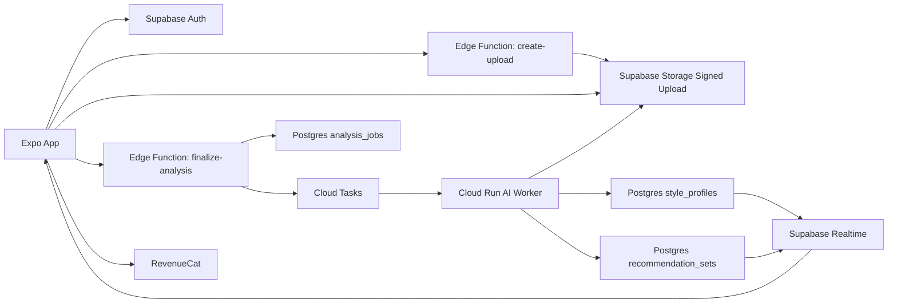

# Teknik Mimari ve Operasyon

## 1. Mimari Karar Özeti

Önerilen sistem, hızlı teslim ve ölçeklenebilirlik arasında dengeli bir hibrit bulut mimarisidir:

- Mobil uygulama: Expo + React Native + TypeScript
- BFF ve veri çekirdeği: Supabase
- AI işleme servisi: Python tabanlı Cloud Run worker
- LLM / vision yönlendirme: OpenRouter üzerinde `google/gemini-3-flash-preview` (selfie ve cilt alt tonu yorumu) + `google/gemini-3.1-flash-lite-preview` (kıyafet fotoğrafı görsel analizi)
- Asenkron görev orkestrasyonu: Cloud Tasks
- Katalog ve öneri verisi: Postgres + pgvector
- Ödeme ve abonelik: RevenueCat + App Store / Google Play
- Analytics: PostHog
- Crash / performance: Sentry

Bu kurgu, "full bulut" hedefiyle uyumludur; özel sunucu yönetimi gerektirmez ve küçük ekiple yürütülebilir.

## 2. Frontend Yığını

### Neden Expo

Expo seçimi doğru çünkü:

- iOS ve Android için tek codebase sağlar
- Kamera, galeri, güvenli depolama, bildirim ve OTA güncelleme katmanları olgundur
- EAS Build ve EAS Update release operasyonunu kolaylaştırır

### Önerilen frontend stack

- `expo-router`
- `@tanstack/react-query`
- `zustand`
- `expo-camera`
- `expo-image-picker`
- `expo-secure-store`
- `expo-notifications`
- `expo-updates`
- `sentry-expo`

### Uygulama modülleri

- Auth ve session
- Capture ve upload
- Analysis result
- Discover / commerce
- Wardrobe
- Subscription
- Settings / privacy center

## 3. Backend Yığını

### Supabase katmanı

Supabase tarafında şu servisler kullanılmalıdır:

- Auth
- Postgres
- Storage
- Realtime
- Edge Functions

### Neden Supabase

- Expo ile entegrasyonu hızlıdır
- Row Level Security ile veri izolasyonu güçlüdür
- Storage ve signed upload kurgusu selfie aktarımı için uygundur
- Postgres ve pgvector aynı yerde kalabildiği için veri mimarisi sadeleşir

### Cloud Run worker

AI pipeline, Edge Function içinde değil ayrı worker'da çalışmalıdır. Bunun sebepleri:

- CPU yoğun image processing
- Uzayan inference süresi
- Kütüphane bağımlılıkları
- Asenkron yeniden deneme ve kuyruk ihtiyacı

Bu worker Python + FastAPI tabanlı olabilir.
Worker içinde model routing sabitlenmeli: selfie/cilt alt tonu yorumları için `google/gemini-3-flash-preview`, kıyafet fotoğrafları için `google/gemini-3.1-flash-lite-preview`.

## 4. Uçtan Uca İstek Akışı

## 5. Servis Sorumlulukları

| Bileşen | Sorumluluk |
| --- | --- |
| Expo App | Auth, capture, upload, sonuç gösterimi, etkileşim |
| Edge Functions | Yetkili BFF uçları, signed upload, webhook işleme, job yaratma |
| Supabase Storage | Selfie ve wardrobe varlıkları için private object storage |
| Postgres | Kullanıcı profili, job durumu, öneri setleri, katalog metadata |
| Cloud Tasks | Yeniden deneme, backoff ve kuyruklama |
| Cloud Run Worker | Görsel analiz, etiketleme, ranking ve sonuç yazma |
| RevenueCat | Abonelik durumunu normalize etme |
| PostHog / Sentry | Ürün ve teknik gözlemlenebilirlik |

## 6. Veri Modeli

### Ana tablolar

| Tablo | Amaç |
| --- | --- |
| `users` | Auth ile eşleşen temel kullanıcı profili |
| `style_profiles` | Undertone, contrast, palette ve güven skorları |
| `analysis_sessions` | Her analiz denemesi, giriş koşulları ve durum |
| `photo_assets` | Storage path, retention ve kaynak metadata |
| `recommendation_sets` | Analize bağlı öneri kümesi |
| `catalog_items` | Ürün ana kaydı |
| `catalog_variants` | Renk ve beden varyantları |
| `catalog_scores` | Ürün ve profil arasındaki uyum skorları |
| `wardrobe_items` | Kullanıcının eklediği kendi ürünleri |
| `feedback_events` | Kullanıcı geri bildirimleri |
| `subscription_states` | RevenueCat normalize edilmiş plan durumu |
| `experiments` | A/B test konfigürasyonları |

### Örnek `style_profiles` alanları

- `user_id`
- `undertone_label`
- `undertone_confidence`
- `contrast_label`
- `contrast_confidence`
- `palette_json`
- `avoid_colors_json`
- `fit_explanation`
- `updated_at`

## 7. API Yüzeyi

Önerilen ana endpoint grupları:

| Endpoint | Metod | Amaç |
| --- | --- | --- |
| `/v1/uploads/selfie-url` | POST | Signed upload URL üret |
| `/v1/analysis/finalize` | POST | Upload sonrası analiz job yarat |
| `/v1/analysis/:id` | GET | Job durumu getir |
| `/v1/profile/style` | GET | Güncel stil profili |
| `/v1/recommendations/home` | GET | Ana öneri akışı |
| `/v1/recommendations/occasion` | POST | Occasion bazlı look'lar |
| `/v1/wardrobe/items` | POST | Gardırop ürünü ekle |
| `/v1/feedback/recommendation` | POST | Kullanıcı sinyali gönder |
| `/v1/subscriptions/webhook` | POST | RevenueCat / store event işleme |
| `/v1/privacy/delete-account` | POST | Hesap ve veri silme akışı başlat |

## 8. Katalog ve Commerce Altyapısı

Ürün önerileri için iki aşamalı katalog sistemi önerilir:

### Aşama 1

- Merchant feed ingest
- Renk ve kategori metadata normalizasyonu
- Editorial curation

### Aşama 2

- Görsel sınıflandırma ile ürün renk/kontrast çıkarımı
- Occasion tag üretimi
- Benzer ürün ve alternatif ürün graph'ı

Affiliate model için katalog kaynağı baştan link-tracking uyumlu tasarlanmalıdır.

## 9. Recommendation Motoru

Skorlama formülü şu eksenlerden kurulmalıdır:

- Undertone uyumu
- Kontrast uyumu
- Occasion uygunluğu
- Kullanıcı davranış sinyali
- Stok ve fiyat uygunluğu
- Marj veya partner önceliği

Ancak ticari baskı, stil doğruluğunu bozmamalıdır. Aksi halde ürün güvenini hızla tüketir.

## 10. Güvenlik

### Uygulama katmanı

- Session token'ları `SecureStore` içinde tutulmalı
- Hassas endpoint'ler için rate limit uygulanmalı
- Abuse önleme için cihaz ve session fingerprint sinyalleri kullanılmalı

### API katmanı

- Supabase RLS tüm kullanıcı verisine uygulanmalı
- Service role anahtarları sadece server-side ortamda tutulmalı
- Signed upload kısa ömürlü olmalı

### Worker katmanı

- Cloud Run private ingress veya doğrulanmış çağrı
- Görev payload'ında ham veri yerine job id taşınmalı
- Tüm işleme log'ları PII'den arındırılmalı

## 11. Gizlilik Operasyonu

Gizlilik merkezi şu aksiyonları uygulama içinden sunmalıdır:

- Fotoğraf saklama tercihini değiştir
- Verimi indir
- Son analizi sil
- Tüm hesabı sil
- Bildirim tercihleri

Bu akışlar destek bileti gerektirmeden self-serve olmalıdır.

## 12. CI/CD ve Ortamlar

### Ortamlar

- `development`
- `staging`
- `production`

### Release zinciri

- GitHub Actions
- Expo EAS Build
- Expo EAS Update
- Supabase migration pipeline
- Cloud Run deploy

### Neden bu düzen

- Mobil istemci ile backend aynı takvimde zorunlu release yapmak gerekmez
- Küçük iyileştirmeler OTA ile hızlı verilebilir
- Model sürümleri backend tarafında kontrollü yönetilebilir

## 13. Gözlemlenebilirlik

Takip edilmesi gereken paneller:

- Upload başarı oranı
- Analiz başarı oranı
- Ortalama inference süresi
- Sonuç ekranına düşen job oranı
- Recommendation CTR
- Subscription paywall dönüşümü
- Hesap silme oranı
- Bölgesel hata dağılımı

Alarm koşulları:

- Analiz başarısı aniden düşerse
- Düşük güven sonuçları artarsa
- Storage temizleme job'ları aksarsa
- Payment webhook gecikirse

## 14. Performans Hedefleri

İlk sürüm için önerilen hedefler:

- Upload sonrası sonuç: p50 < 12 saniye
- Upload sonrası sonuç: p95 < 30 saniye
- Home feed açılışı: p50 < 1.5 saniye
- Crash free session: > %99

## 15. Takım Yapısı

İlk 6-9 aylık ekip önerisi:

- 1 mobil lead
- 1 full-stack / platform engineer
- 1 ML engineer
- 1 product designer
- 1 product manager / founder
- Part-time growth + content

Katalog ve partner entegrasyonları büyüdüğünde commerce ops eklenebilir.

## 16. Teknik Borç Yönetimi

Özellikle şu alanlarda erken disiplin şart:

- Model sürümleme
- Storage retention job'ları
- Katalog veri kalitesi
- Feature flag sistemi
- Analytics event sözlüğü

Bu beş alan ihmal edilirse ürün hızla karmaşıklaşır.
